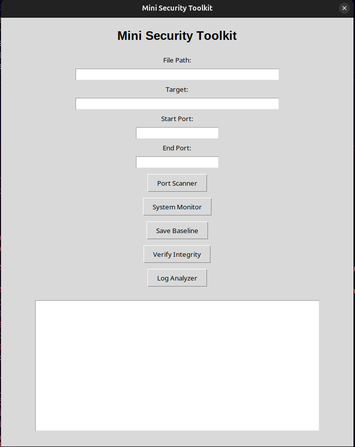
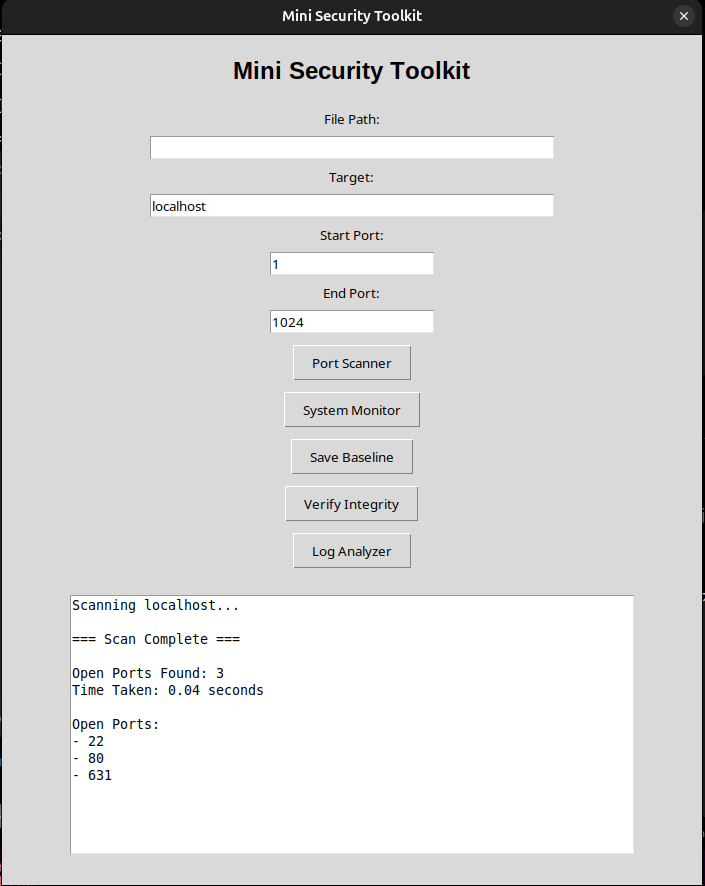
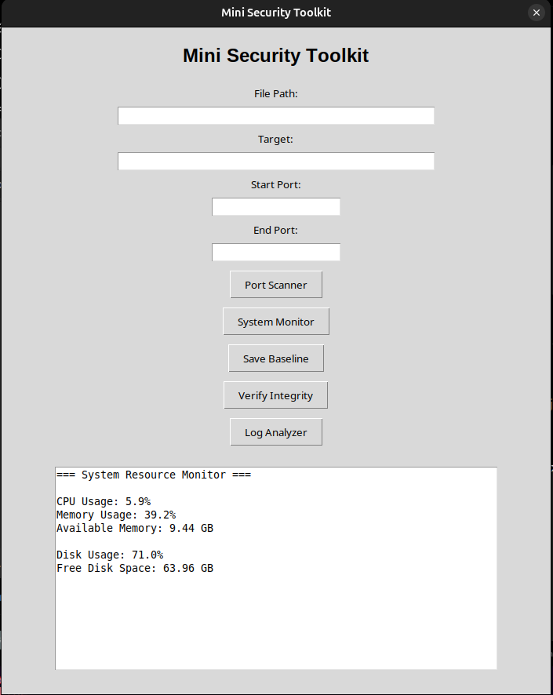
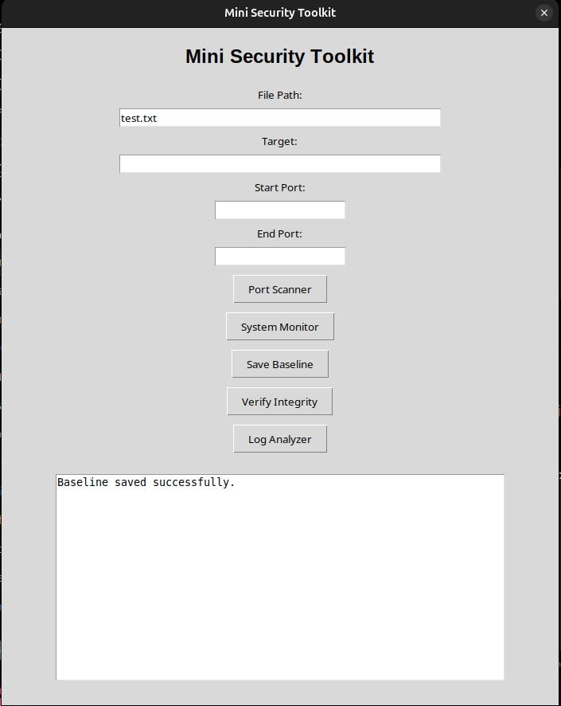
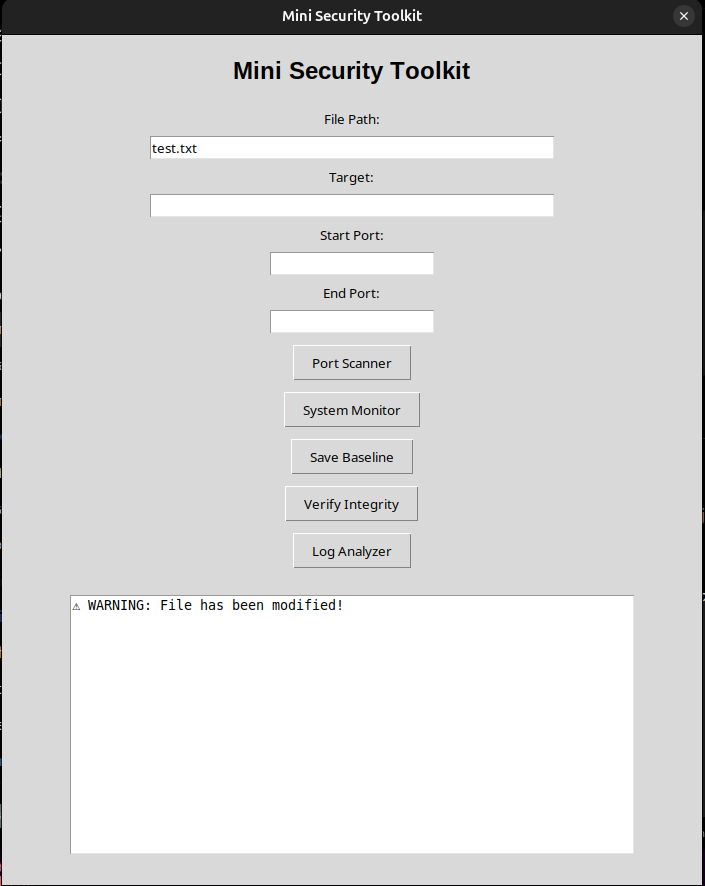
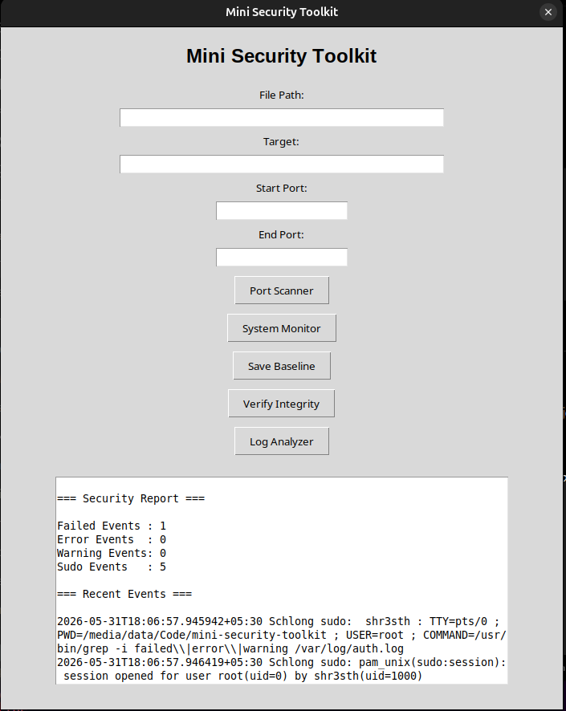

# Mini Security Toolkit

A modular Python-based security toolkit built to demonstrate core defensive cybersecurity concepts through a command-line and graphical interface.

## Features

### Port Scanner

- Scan a target host across a custom port range
- Displays open ports
- Provides scan statistics and timing information

### System Resource Monitor

- CPU usage monitoring
- Memory usage monitoring
- Disk usage monitoring

### File Integrity Monitor

- Generates SHA-256 file hashes
- Saves integrity baselines
- Detects file modifications
- Supports baseline updates

### Log Analyzer

- Analyzes Linux authentication logs
- Detects failed, warning, error, and sudo events
- Generates a security summary report

---

## Technologies Used

- Python
- Tkinter
- Socket Programming
- SHA-256 Hashing
- psutil

---

## Project Structure

```text
mini-security-toolkit/
├── modules/
│   ├── port_scanner.py
│   ├── system_monitor.py
│   ├── file_integrity.py
│   └── log_analyzer.py
│
├── data/
├── screenshots/
│
├── main.py
├── gui.py
├── requirements.txt
└── README.md
```

## Screenshots

### Main GUI



### Port Scanner



### System Monitor



### File Integrity Monitor





### Log Analyzer



---

## Installation

```bash
git clone https://github.com/shr3sth/mini-security-toolkit.git

cd mini-security-toolkit

pip install -r requirements.txt
```

## Usage

### CLI

```bash
python3 main.py
```

### GUI

```bash
python3 gui.py
```

---

## Disclaimer

This project is intended for educational and defensive cybersecurity purposes only.
